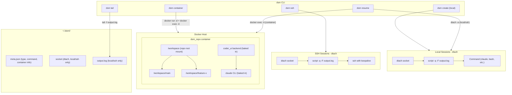

```mermaid
flowchart TD
  subgraph CLI[dsm CLI]
    CLI_Create["dsm create (local)"]
    CLI_SSH["dsm ssh"]
    CLI_Container["dsm container"]
    CLI_Resume["dsm resume"]
    CLI_Tail["dsm tail"]
  end

  subgraph Local[Local Sessions - dtach]
    DtachLocal["dtach socket"]
    ScriptCapture["script -q -F output.log"]
    LocalCmd["Command (claude, bash, etc.)"]
    DtachLocal --> ScriptCapture --> LocalCmd
  end

  subgraph SSH[SSH Sessions - dtach]
    DtachSSH["dtach socket"]
    SSHCapture["script -q -F output.log"]
    SSHCmd["ssh with keepalive"]
    DtachSSH --> SSHCapture --> SSHCmd
  end

  subgraph DockerHost[Docker Host]
    subgraph Container["dsm_repo container"]
      RepoMount["/workspace (repo root mount)"]
      CoderUI["coder_ui backend (baked in)"]
      ClaudeCLI["claude CLI (baked in)"]
      WT1["/workspace/main"]
      WT2["/workspace/feature-x"]
      RepoMount --> WT1
      RepoMount --> WT2
      CoderUI --> ClaudeCLI
    end
  end

  subgraph Meta["~/.dsm/<session-id>/"]
    MetaJSON["meta.json (type, command, container info)"]
    Socket["socket (dtach, local/ssh only)"]
    OutputLog["output.log (local/ssh only)"]
  end

  CLI_Create --> Local
  CLI_SSH --> SSH
  CLI_Container --> |"docker run -d + docker exec -it"| DockerHost
  CLI_Resume --> |"dtach -a (local/ssh)"| Local
  CLI_Resume --> |"docker exec -it (container)"| DockerHost
  CLI_Tail --> |"tail -f output.log"| OutputLog
```
