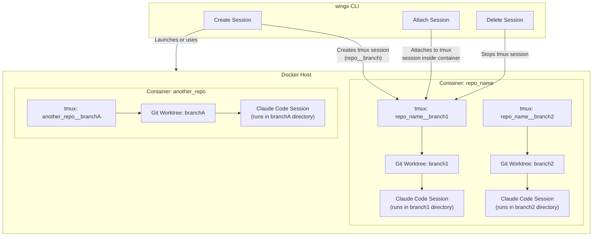

```mermaid
flowchart TD
  subgraph CLI[wingx CLI]
    CLI_Create["Create Session"]
    CLI_Attach["Attach Session"]
    CLI_Delete["Delete Session"]
  end

  subgraph DockerHost[Docker Host]
    subgraph Container1["Container: repo_name"]
      TmuxSession1["tmux: repo_name__branch1"]
      WorkingTree1["Git Worktree: branch1"]
      ClaudeSession1["Claude Code Session\n(runs in branch1 directory)"]
      
      TmuxSession2["tmux: repo_name__branch2"]
      WorkingTree2["Git Worktree: branch2"]
      ClaudeSession2["Claude Code Session\n(runs in branch2 directory)"]
    end

    subgraph Container2["Container: another_repo"]
      TmuxSession3["tmux: another_repo__branchA"]
      WorkingTree3["Git Worktree: branchA"]
      ClaudeSession3["Claude Code Session\n(runs in branchA directory)"]
    end
  end

  CLI_Create --> |"Launches or uses"| DockerHost
  CLI_Create --> |"Creates tmux session\n(repo__branch)"| TmuxSession1
  CLI_Attach --> |"Attaches to tmux\nsession inside container"| TmuxSession1
  CLI_Delete --> |"Stops tmux session"| TmuxSession1

  TmuxSession1 --> WorkingTree1
  WorkingTree1 --> ClaudeSession1

  TmuxSession2 --> WorkingTree2
  WorkingTree2 --> ClaudeSession2

  TmuxSession3 --> WorkingTree3
  WorkingTree3 --> ClaudeSession3
```