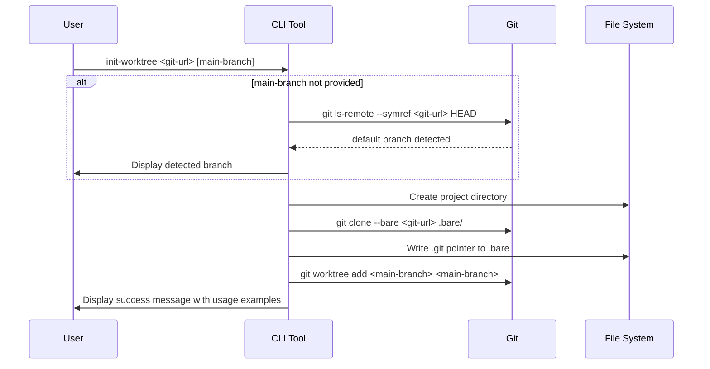
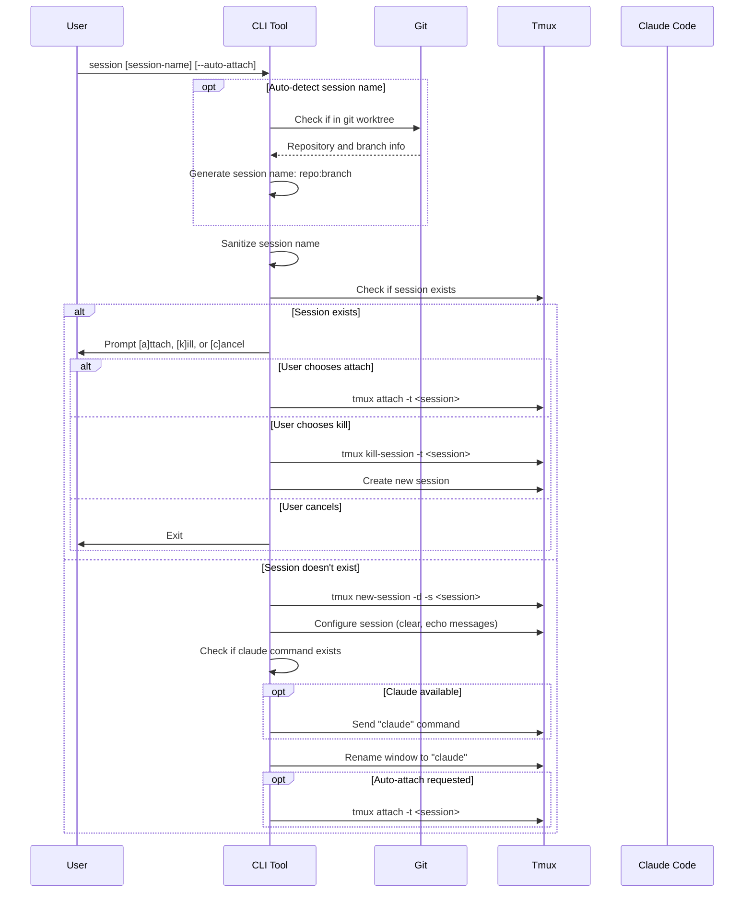
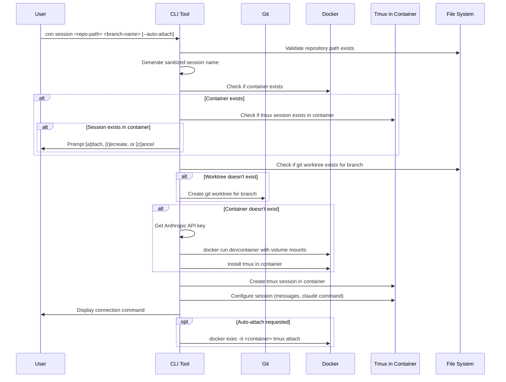
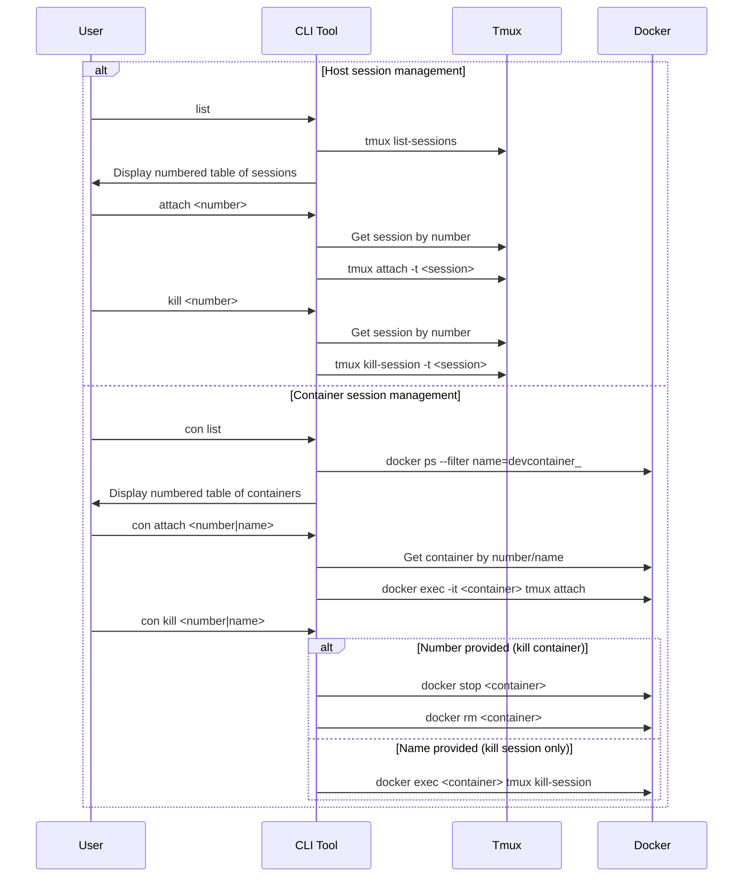
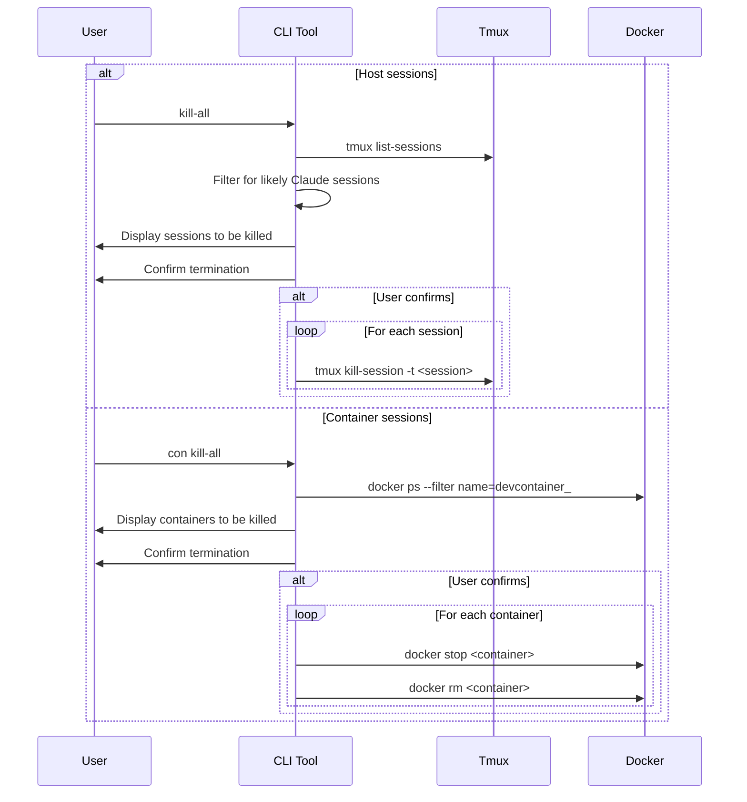
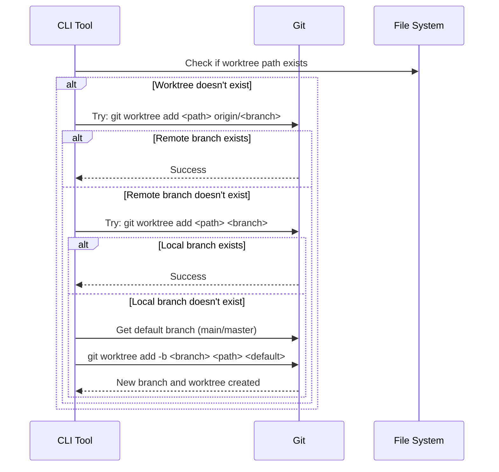

# Development CLI Workflows - Mermaid Sequence Diagrams

This document contains mermaid sequence diagrams for the standard workflows supported by the development CLI defined in `cli.py`.

## 1. Git Worktree Initialization Workflow

## 2. Host Claude Session Management Workflow

## 3. Container Session Management Workflow

## 4. Session List and Management Workflow

## 5. Bulk Session Termination Workflow

## 6. Git Worktree Creation Within Container Session

## Key Workflow Features

### Host vs Container Operations
- **Host commands**: Direct tmux session management on local machine
- **Container commands**: Docker-based isolated environments with tmux sessions

### Session Naming Convention
- **Host**: `repository:branch` (auto-detected from git)
- **Container**: `repository__branch` (sanitized for Docker)

### State Management
- Automatic detection of existing sessions/containers
- Interactive prompts for conflict resolution
- Graceful fallbacks for missing dependencies

### Integration Points
- Git worktree integration for branch-specific workspaces
- Claude Code integration for AI-assisted development
- Anthropic API key management across environments